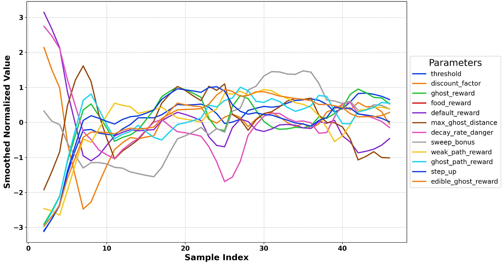
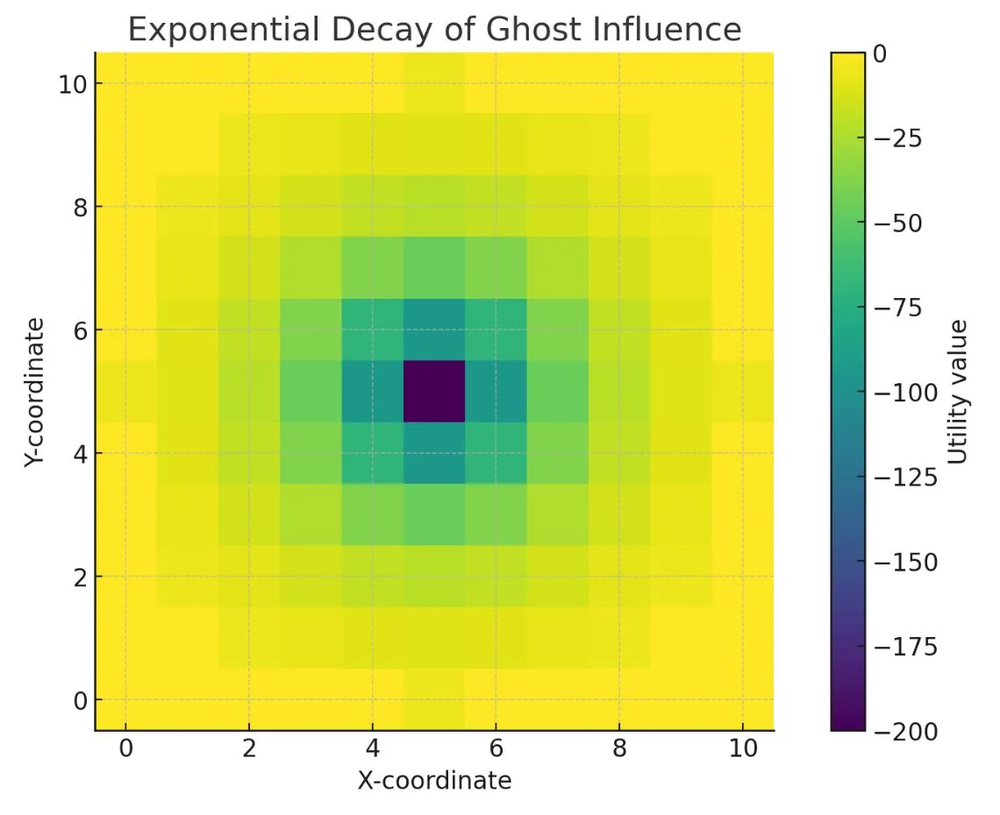
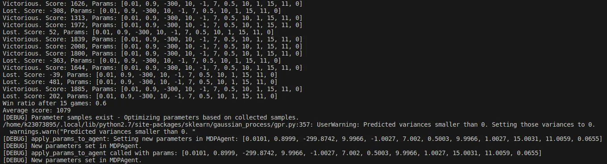
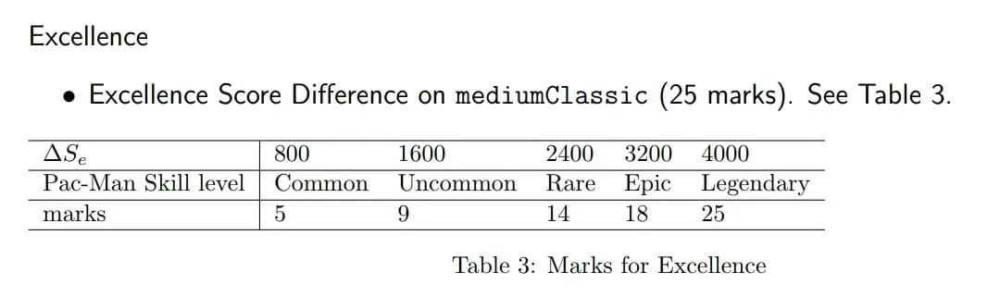
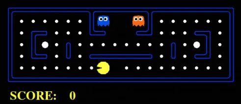
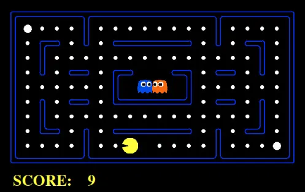
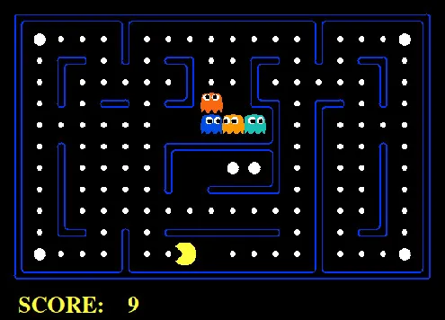
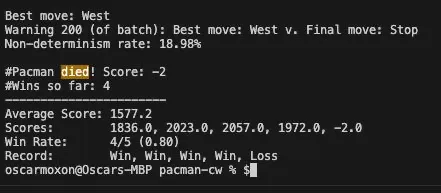
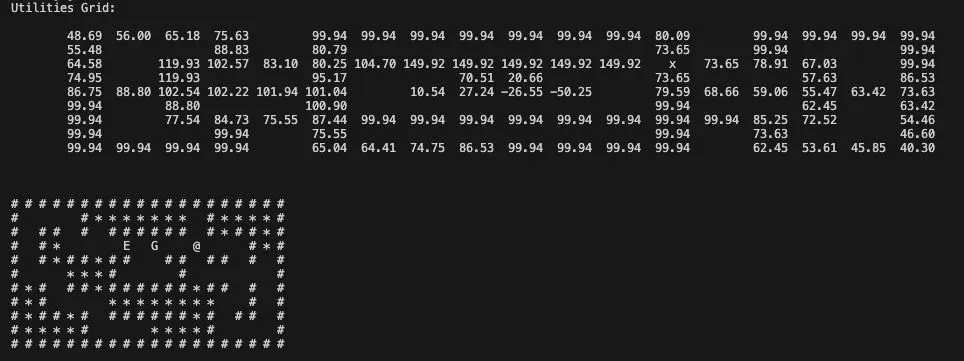

# Unifinished Write-Up: Building an Immortal Pacman

Recently, I was presented with the task of forking the Berkeley AI Pacman Environment and building a Pac-Man that never dies. 

## Contents:

- Model-Based Approach
- Reward-Grid Initialisation (with select code)
- Bayesian Optimisation on Parameters
- Further Research

### Introduction

Developing an agent using Berkeley’s Pacman dataset was a challenging endeavour that involved solving Pac-Man using a utility modelling system/Markov decision process.

Rψ​(Ag,Env) = {R | R satisfies ψ in the context of Ag and Env}

The Predicate Task Specification maps ψ: R → {0, 1}, turning our coursework on MDPs into a practical decision-making process.

### Model-based Reinforcement Learning

We utilized model-based reinforcement learning, which is distinct from learned or deep-learned approaches with Q-learning/self-play. The states in this environment are near-perfectly Markovian, making traditional Q-learning an option; however, we explored policy iteration to account for certain environmental variables that proved challenging for Pac-Man.

### Utility Modelling and A* Search

The utility model employed an A* search with an exponential fall-off to navigate the maze effectively, while the Bellman equation provided the foundation for our approach. 

As shown in the graph above, Bayesian Optimization was critical in tuning the parameters to achieve a balance between exploration and exploitation.

### Challenges and Adjustments

Upon deeper analysis, we discovered that Pac-Man's world is inherently non-deterministic. This realization led us to modify our approach, including the Bellman equation, to better accommodate the unpredictable nature of the game.

The image above illustrates the exponential decay of ghost influence, a crucial aspect of our utility-based model, enabling Pac-Man to anticipate and evade ghosts more effectively.

### Bayesian Optimization in Action

Bayesian Optimization played a pivotal role in iteratively refining our parameters, as depicted in the following terminal output.

We normalized the parameter space and recalibrated weights after each batch to continually improve the agent's performance.

### Excellence in Numbers

The following table showcases the score differences and the corresponding skill levels assigned to Pac-Man, which were used as benchmarks for agent performance.

### Strategic Gameplay and Results

Strategic gameplay was essential for our agent's success. By prioritizing certain actions over others, we were able to significantly improve Pac-Man's survivability.

- Ghost danger paths should override all other considerations.
- Chasing edible ghosts takes precedence only when safe to do so.
- Capturing capsules becomes a tactical decision.
- Food clusters and individual pieces are valued based on their safety and proximity.

Above, you can see Pac-Man navigating a smaller maze where strategic decisions are key due to limited space and high ghost interaction.

In a medium-sized maze, Pac-Man must balance the risk of ghost encounters with the need to clear food efficiently.

The large maze presents a different challenge, with more space to maneuver but also greater distances to cover for food and capsules.

In the scenario above, Pac-Man's decision to move west showcases the application of these strategic considerations.

### Final Thoughts and Observations

This project has been an intensive foray into the world of AI and gaming, and the results have been both fascinating and informative.

The utilities grid and the game's terminal output provide insights into the agent's decision-making process and the outcomes of various strategies.