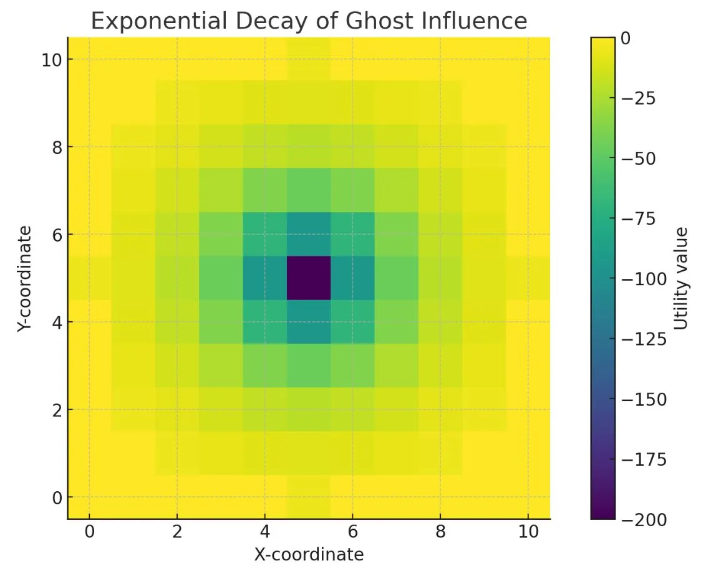

# Building Immortal Agents with Reinforcement Learning

# Unfinished Project: Building an Immortal Pac-Man

Recently, I was presented with the task of forking the Berkeley AI Pacman Environment and building a Pac-Man that never dies. 

## Contents:

- Model-Based Approach
- Reward-Grid Initialisation (with select code)
- Bayesian Optimisation on Parameters
- Further Research

### Introduction

I recently developed an agent using Berkeley’s Pacman dataset, aiming to solve Pac-Man using a utility modelling system/Markov decision process.

I recently developed an agent using Berkley’s Pacman dataset, to solve pacman using a utility modelling system/markov decision process.

Rψ​(Ag,Env)={R∣R satisfies ψ in the context of Ag and Env}

With Predicate Task Specification of that maps ψ: R → {0, 1}

Ingenuously, my professor turned our coursework on MDPs INTO a Markov decision process when he presented us with this grid:

Model-based reinforcement learning, as opposed to learned/deep-learned with Q-learning/self-play. I would like to take this further into the area of multi-agent play, particularly multi-agent reinforcement learning. Intro: Self-play and supervised learning, etc. search space? Q-learning could be used in the traditional sense as the states are almost perfectly markovian. However, some policy iteration system over time would be beneficial, as there are some environmental variables that give pacman a hard time; such as when it eats a ghost in the ‘den’, and dies instantly when the ghost respawns on top of it.In Qlearning, discount factor would be modelled with a similar approach to chess.

Utility modelling: A* search with exponential fall-off

Bellman equation

Scope: balancing weights more effectively…?

Some non-trivial amount of time into the project, I realised that Pacman is non-deterministic, after running a long debugging process, confused why the optimal direction wasn’t being picked. This means we must modify the bellman equation ^

While this has low impact on computation time, it means that when before Pacman had no chance of getting caught by a ghost right behind him on a long corridor, it now means that a corridor of length 5 will have around 32% chance of killing Pacman, with logarithmic diminishing odds over time. To incorporate this, we can balance the odds of dying in long corridors by increasing the danger of ghosts. Now, Pacman will consider them at max_distance = 3, allowing it to see further round corners in order to increase survival chances. The point 3 squares away from a ghost is now around 2/3 less attractive than it was before, meaning Pacman will change his path if there.

Ghosts initially implemented so that pacman would find the shortest path to nearest ghost and chase along it. If it ate a ghost, it moves on to next assuming it is near enough. To avoid entering the den (one of the main WhyDies) it ignores ghosts when they’re not at an original food_list location (show set() code)

When the ghosts are edible they move at half speed, so A* is remarkably effective.

One of the problems with making a highly cautious agent is that it’s increasingly possible for the agent to get ‘chased off’ the final pieces of food, particularly if it is clearing things as efficiently as mine. 

One way of fixing this would be with an exploration function. Another would be with a falloff for the food that is vast....

My pacman consistently eats both ghosts every time it eats a capsule (x % of the time)

Main reason it dies: non-deterministic moves mean it is exposed to missteps, especially when chasing an edible ghost.

CENTRE^

To overcome this (when upping utility for the shortest path to eat each ghost, pacman can ignore the danger of the second ghost severely, due to the Bellman implementation) we need to ensure that the dangerous ghost interrupts Pacman’s greediness. Here’s an example of what I mean. The dangerous ghost is literally in the way of the A* path to the edible ghost. Bellman only iterates over the highest values, which here are 15, while the ghosts are -200. This means that despite being in the direct path, Pacman (@) will barrel straight into the ghost.

Hierarchy of rewards: 

Ghost danger paths should override everything.

Then A* path to edible ghosts (some of time).

Then capsules.

Then food clusters.

Then food.

Then empty spaces.

For easy debugging, set the terminal scrollback to 100k - after a run find all the times pacman died and I used this configuration to retrace steps.

This is propagated along the A* paths.

I run A* search so that pacman never gets lost (always at least one food to travel to), and then make this very weak.

The capsule should be more of a tactical capture. It should consider the position of pacman and how close the ghosts are. Particularly for small maze...

III: Bayesian Optimisation

Normalize the parameter space. Settings proposed.

This takes 1:15 seconds per batch, then weights are recalibrated.

Consider editing this graph to make the trend more obvious. Why does this trend make sense?

